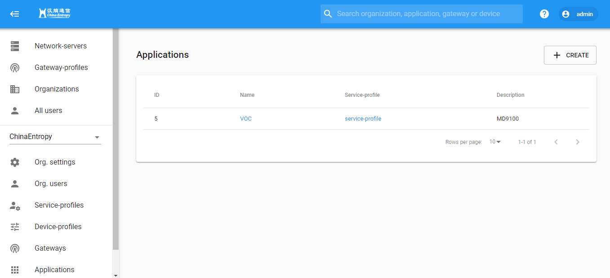

# Lora Server 搭建

​	LoRa Server项目提供了用于构建LoRaWAN网络的各个组件。它们共同构成了一个随时可用的解决方案，包括用户友好的Web界面以及gRPC和REST API。组件也可以换出以进行自定义或将LoRa Server集成到现有基础架构中。


​	Lora服务搭建只需要执行`docker-compose up -d`一条命令即可搭建完毕，搭建完后会启动如下7个服务：


​	具体文件如下：


- 目前目录结构


```shell
.
|-- configuration								//配置文件根目录
|   |-- lora-app-server							
|   |   |-- certs
|   |   |   |-- http-key.pem
|   |   |   |-- http.pem
|   |   |-- lora-app-server.toml
|   |-- lora-gateway-bridge
|   |   |-- lora-gateway-bridge.toml
|   |-- lora-geo-server
|   |   |-- lora-geo-server.toml
|   |-- loraserver
|   |   |-- loraserver.toml
|   |-- postgresql
|       |-- initdb
|           |-- 001-init-loraserver_ns.sh
|           |-- 002-init-loraserver_as.sh
|           |-- 003-loraserver_as_trgm.sh
|-- data										//数据备份目录（启动后自动生成）
|   |-- postgresql
|   |-- redis
|-- docker-compose.yml							//容器编排文件
|-- lora-app-server								//lora-app-server 容器构建目录
```


- 界面展示（已更换Logo）

  - 登陆界面

  

  - 管理员界面

  

  - 普通用户界面

  


- API

  

  