# 平台对比

- loriot

  - 界面

    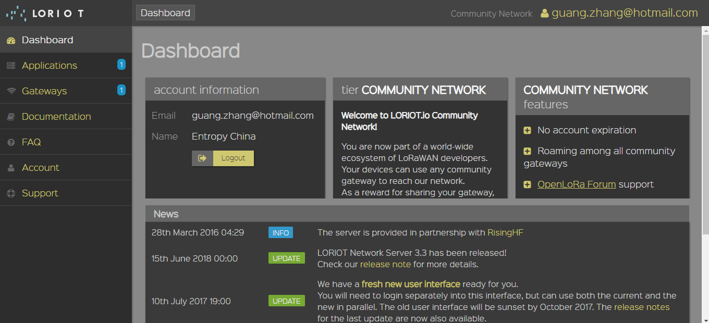

    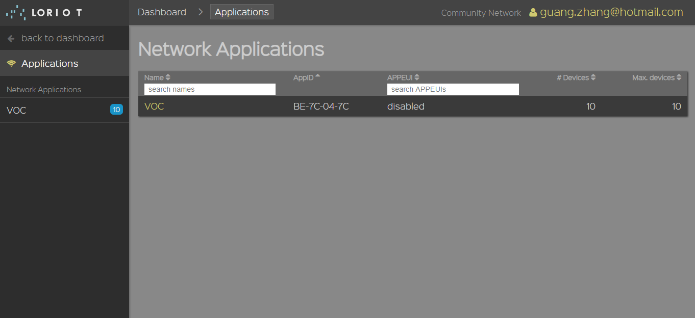

    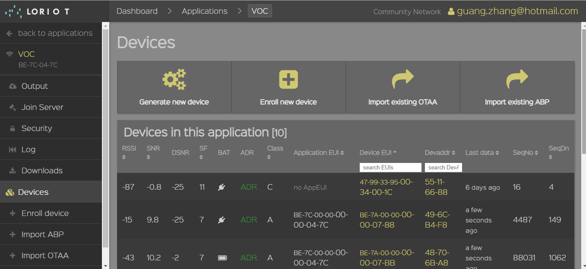

  - 优缺点

    - 优点：简单易上手；
    - 缺点：界面不优雅；

- 艾森-loraflow

  - 界面

    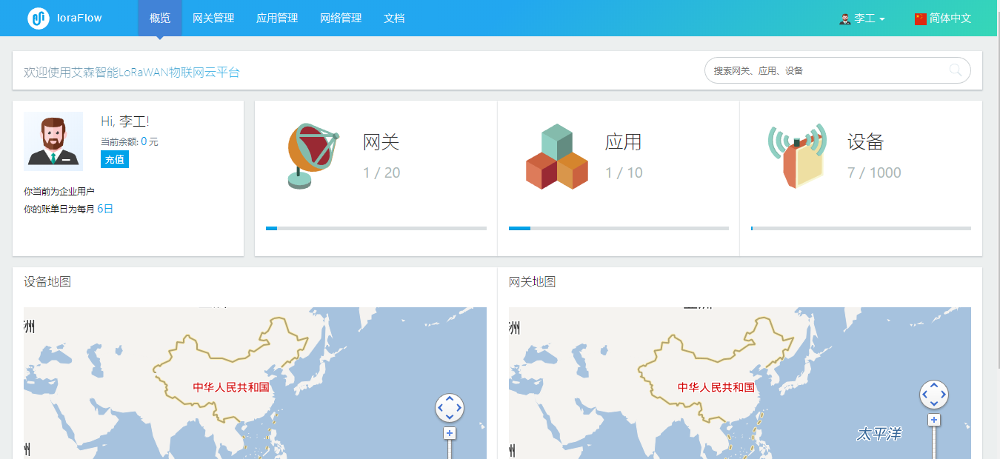

    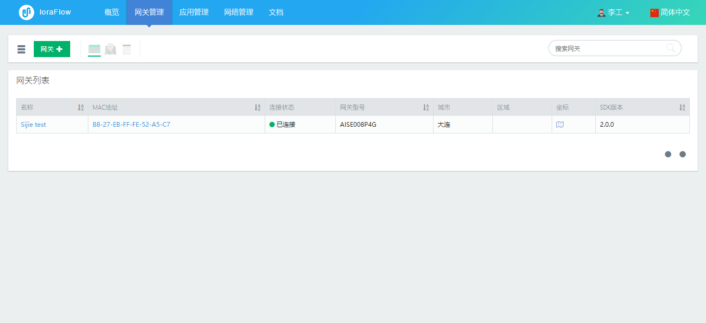

    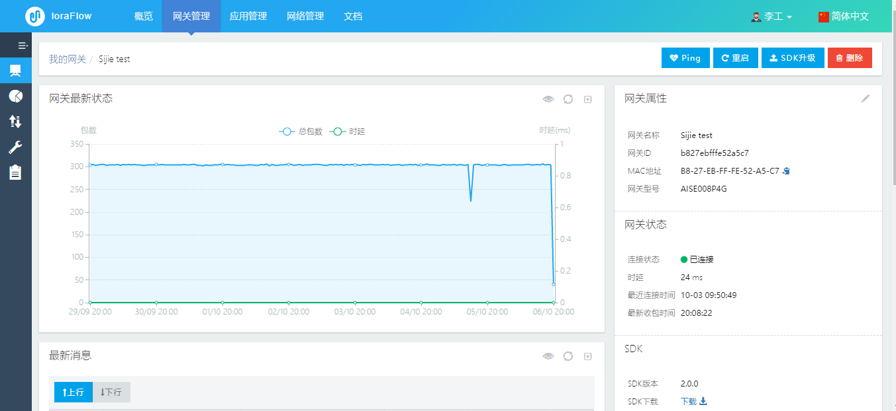

    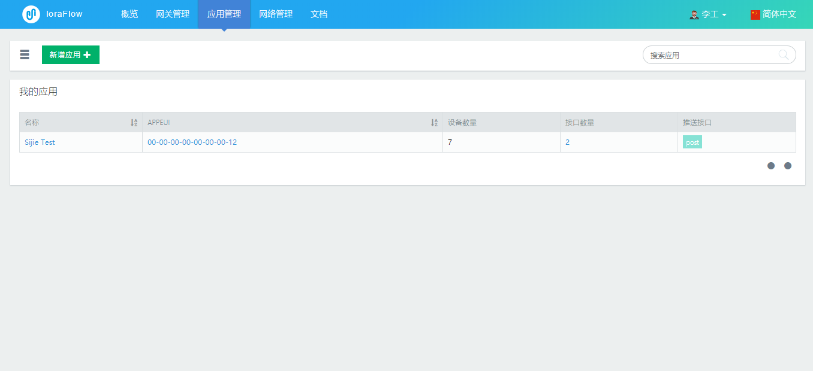

    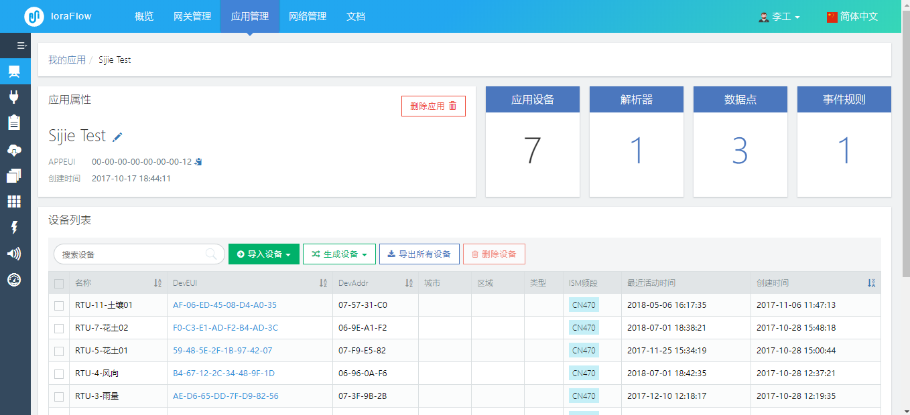

  - 优缺点

    - 优点：界面美观，功能多；
    - 缺点：收费，功能复杂反而不易上手；

- 一个网友的站点

  - 界面

    

    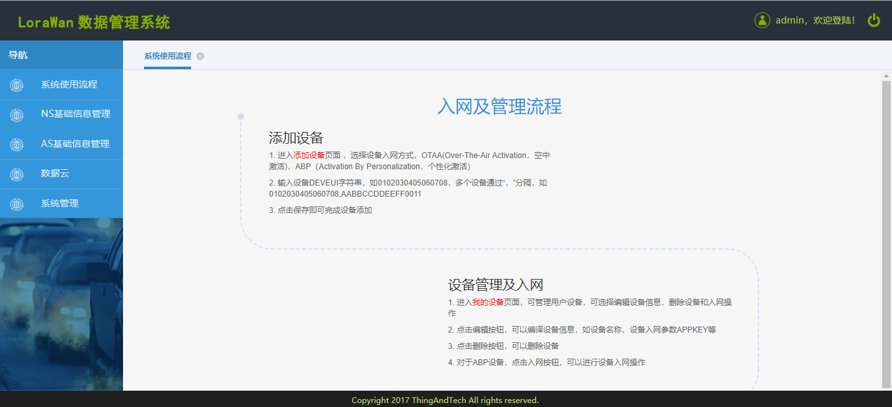

    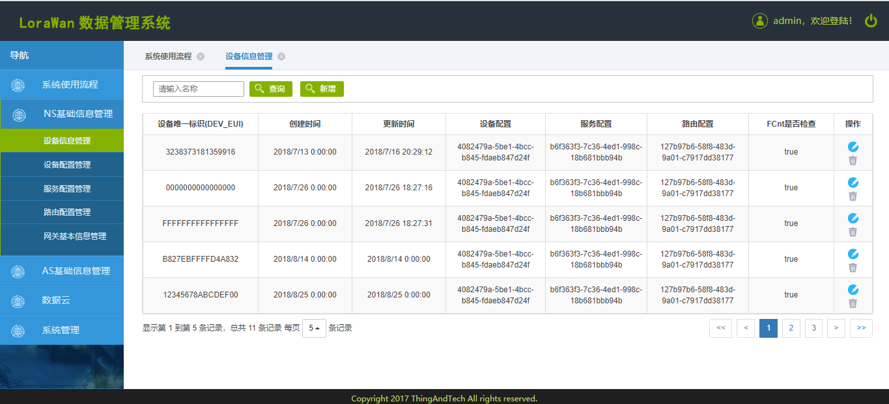

    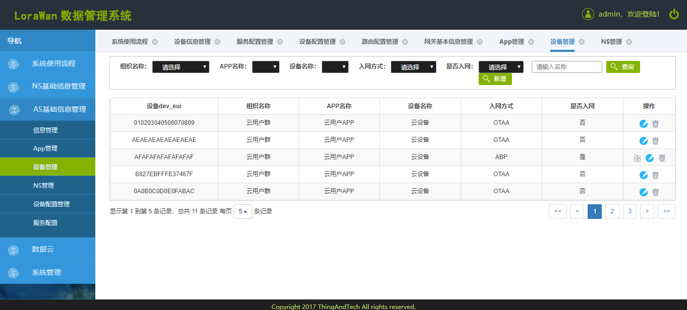

  - 优缺点

    - 优点：配置简单，但是很混乱；
    - 缺点：界面不优雅，配置虽然简单，但是略显混乱；

  ​

